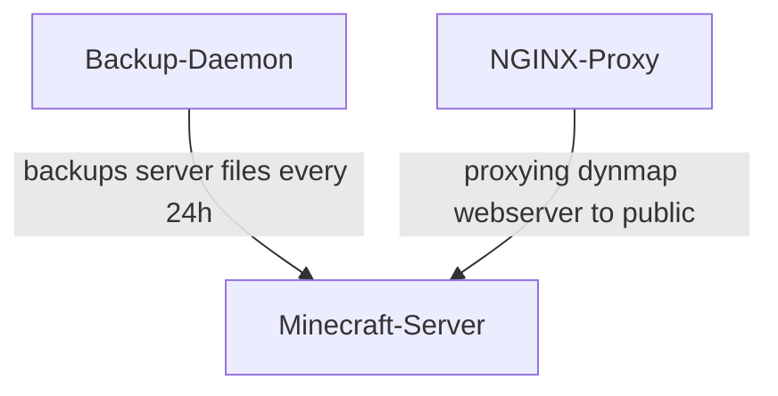

# Spielwiese Minecraft Server 

The Spielwiese Minecraft server runs on a 3 container based infrastructure:

```mermaid
graph TD;
    Backup-Daemon-- backups server files every 24h -->Minecraft-Server;
    NGINX-Proxy-- proxying dynmap webserver to public -->Minecraft-Server;
```

Simple, isn't it? At least it should be. 

**WIP**